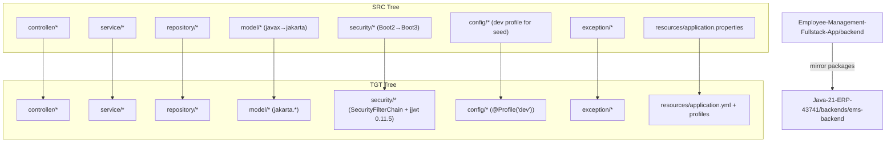

# Repository and Module Mapping: Employee Management Backend → Java 21 ERP Backend

## Overview

This document provides explicit file and module mapping from the existing Spring Boot backend in Employee-Management-Fullstack-App/backend to the new Java 21-compatible Spring Boot 3 backend module inside the Java-21-ERP-43741 repository. The mapping preserves package structure, class names, and logical layering to maintain 100% functionality and architecture parity.

## Target Layout in Java-21-ERP-43741

- Java-21-ERP-43741/
  - backends/
    - ems-backend/
      - pom.xml
      - src/
        - main/
          - java/
            - com/example/employeemanagement/
              - controller/
              - service/
              - repository/
              - model/
              - security/
              - config/
              - exception/
          - resources/
            - application.yml
            - application-dev.yml
            - application-mysql.yml
            - application-mongo.yml
        - test/
          - java/
            - com/example/employeemanagement/...

## High-Level Mapping

The following mapping shows how each package and representative class should be mirrored.

### Controllers

| Source (Employee-Management-Fullstack-App) | Target (Java-21-ERP-43741) |
|--------------------------------------------|-----------------------------|
| backend/src/main/java/com/example/employeemanagement/controller/AuthController.java | backends/ems-backend/src/main/java/com/example/employeemanagement/controller/AuthController.java |
| backend/src/main/java/com/example/employeemanagement/controller/EmployeeController.java | backends/ems-backend/src/main/java/com/example/employeemanagement/controller/EmployeeController.java |
| backend/src/main/java/com/example/employeemanagement/controller/DepartmentController.java | backends/ems-backend/src/main/java/com/example/employeemanagement/controller/DepartmentController.java |
| backend/src/main/java/com/example/employeemanagement/controller/HomeController.java | backends/ems-backend/src/main/java/com/example/employeemanagement/controller/HomeController.java |

Notes:
- Keep endpoint paths unchanged: /api/employees, /api/departments, /authenticate, /register, /verify-username/{username}, /reset-password.
- Preserve OpenAPI annotations.

### Services

| Source | Target |
|--------|--------|
| backend/src/main/java/com/example/employeemanagement/service/EmployeeService.java | backends/ems-backend/src/main/java/com/example/employeemanagement/service/EmployeeService.java |
| backend/src/main/java/com/example/employeemanagement/service/DepartmentService.java | backends/ems-backend/src/main/java/com/example/employeemanagement/service/DepartmentService.java |

### Repositories

| Source | Target |
|--------|--------|
| backend/src/main/java/com/example/employeemanagement/repository/EmployeeRepository.java | backends/ems-backend/src/main/java/com/example/employeemanagement/repository/EmployeeRepository.java |
| backend/src/main/java/com/example/employeemanagement/repository/DepartmentRepository.java | backends/ems-backend/src/main/java/com/example/employeemanagement/repository/DepartmentRepository.java |
| backend/src/main/java/com/example/employeemanagement/repository/UserRepository.java | backends/ems-backend/src/main/java/com/example/employeemanagement/repository/UserRepository.java |

### Models

| Source | Target |
|--------|--------|
| backend/src/main/java/com/example/employeemanagement/model/Employee.java | backends/ems-backend/src/main/java/com/example/employeemanagement/model/Employee.java |
| backend/src/main/java/com/example/employeemanagement/model/Department.java | backends/ems-backend/src/main/java/com/example/employeemanagement/model/Department.java |
| backend/src/main/java/com/example/employeemanagement/model/User.java | backends/ems-backend/src/main/java/com/example/employeemanagement/model/User.java |

Migration note:
- Replace javax.persistence.* with jakarta.persistence.* imports.

### Security

| Source | Target | Migration Notes |
|--------|--------|-----------------|
| backend/src/main/java/com/example/employeemanagement/security/CustomUserDetailsService.java | backends/ems-backend/src/main/java/com/example/employeemanagement/security/CustomUserDetailsService.java | No functional change |
| backend/src/main/java/com/example/employeemanagement/security/JwtRequestFilter.java | backends/ems-backend/src/main/java/com/example/employeemanagement/security/JwtRequestFilter.java | Ensure filter is registered via SecurityFilterChain |
| backend/src/main/java/com/example/employeemanagement/security/JwtTokenUtil.java | backends/ems-backend/src/main/java/com/example/employeemanagement/security/JwtTokenUtil.java | Upgrade to jjwt 0.11.5 parserBuilder() API and strong key |
| backend/src/main/java/com/example/employeemanagement/security/SecurityConfig.java | backends/ems-backend/src/main/java/com/example/employeemanagement/security/SecurityConfig.java | Replace WebSecurityConfigurerAdapter with @Bean SecurityFilterChain and stateless JWT setup |

### Config

| Source | Target | Notes |
|--------|--------|-------|
| backend/src/main/java/com/example/employeemanagement/config/CorsConfig.java | backends/ems-backend/src/main/java/com/example/employeemanagement/config/CorsConfig.java | Keep permissive in dev; tighten later if needed |
| backend/src/main/java/com/example/employeemanagement/config/DataInitializer.java | backends/ems-backend/src/main/java/com/example/employeemanagement/config/DevDataInitializer.java | Add @Profile("dev") to avoid production data mutation |

### Exception

| Source | Target |
|--------|--------|
| backend/src/main/java/com/example/employeemanagement/exception/ResourceNotFoundException.java | backends/ems-backend/src/main/java/com/example/employeemanagement/exception/ResourceNotFoundException.java |

### Resources and Config

| Source | Target | Notes |
|--------|--------|-------|
| backend/src/main/resources/application.properties | backends/ems-backend/src/main/resources/application.yml | Split into application-dev.yml, application-mysql.yml, application-mongo.yml |
| openapi.yaml (root) | backends/ems-backend/src/main/resources/openapi.yaml (optional) | For reference or integration with springdoc if desired |

### Tests

| Source | Target | Notes |
|--------|--------|-------|
| backend/src/test/java/com/example/employeemanagement/** | backends/ems-backend/src/test/java/com/example/employeemanagement/** | Ensure tests run under dev profile or include H2 test config |

## Migration-Specific Adjustments

- Jakarta migration:
  - javax.persistence.* → jakarta.persistence.*
  - javax.validation.* → jakarta.validation.* (if used)
- JJWT upgrade:
  - io.jsonwebtoken:jjwt 0.9.1 → 0.11.5 with jjwt-api, jjwt-impl, jjwt-jackson
  - Use Keys.hmacShaKeyFor and Jwts.parserBuilder()
- Spring Security 6 (Boot 3):
  - Remove WebSecurityConfigurerAdapter
  - Provide SecurityFilterChain bean, set stateless session, add JwtRequestFilter before UsernamePasswordAuthenticationFilter
  - Expose AuthenticationManager via AuthenticationConfiguration

## Mermaid: Repository and Module Mapping Overview

## Copy/Port Commands (Illustrative)

- Ensure folders exist; then copy while preserving packages, and adjust imports/security where noted.
- Validate compile under Java 21 with the new pom.xml before proceeding to test.

## Verification

- After copying, run: mvn spring-boot:run -Dspring-boot.run.profiles=dev
- Validate endpoints, JWT flows, and Swagger UI
- Execute repository tests using H2 (MySQL mode) to ensure CRUD parity

---
This mapping ensures a predictable, low-risk port while keeping the exact architecture, endpoints, and models intact.
